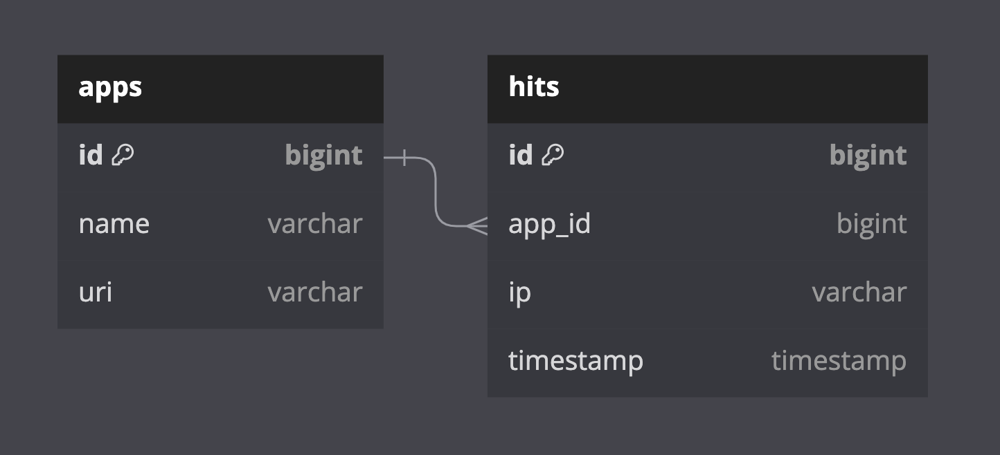

# java-explore-with-me
## Этап 1. 
### _Сервис статистики_
### ER-диаграмма

[Ссылка на диаграмму](stats-server/stats-service/src/main/resources/static/er-diagram-stats.png)

### Описание БД

#### apps
Содержит данные о сервисах и uri, для которых собирается статистика. 

**Поля:**
* первичный ключ id — идентификатор записи;
* name — название сервиса для которого записывается информация
* uri — URI сервиса

#### hits
Содержит данные о просмотрах.

**Поля:**
* первичный ключ id — идентификатор записи;
* app_id — идентификатор пары сервис-uri
* ip — IP-адрес пользователя, осуществившего запрос
* timestamp — дата и время запроса

### _HTTP-клиент для работы с сервисом статистики_
#### Тесты E2E для клиента
Прописаны в контроллере EventController в основном сервисе.

#### Запись в базу
* http://localhost:8080/events/{id} — записать данные о просмотре соответствующей страницы "/event/{id}"

#### Запрос статистики
* http://localhost:8080/events/stats — получить статистику за прошедший час
* http://localhost:8080/events/stats-uris — получить статистику за прошедший час для списка из "/events/1"
* http://localhost:8080/events/stats-unique — получить статистику уникальных просмотров за прошедший час
* http://localhost:8080/events/stats-uris-unique — получить статистику уникальных просмотров за прошедший час 
для списка из "/events/1" и "/events/2"
