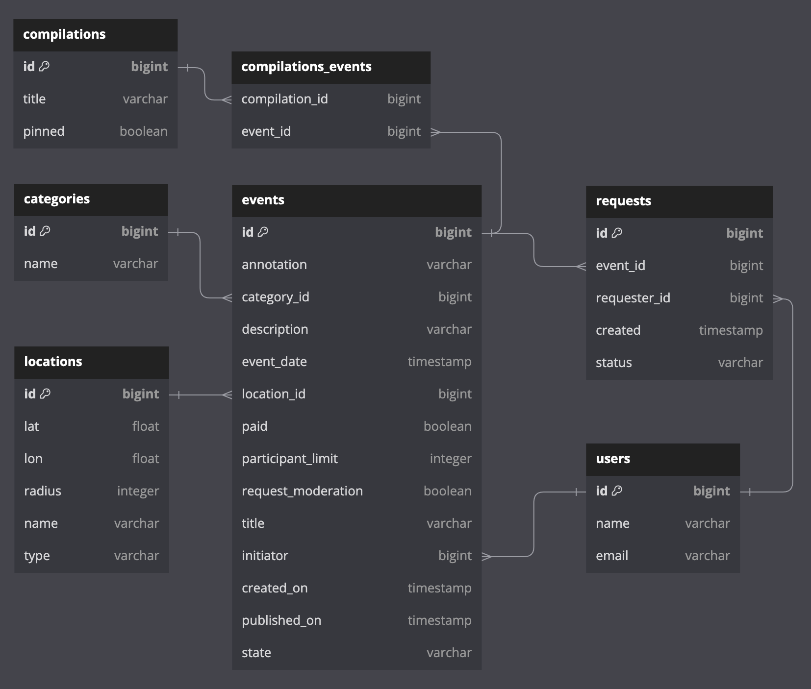

# java-explore-with-me

## _Основной сервис_

### Дополнительная функциональность
#### _ЗАДАЧА_
- Возможность для администратора добавлять конкретные локации: города, театры, концертные залы и другие в виде координат (широта, долгота, радиус). 
- Получение списка этих локаций. 
- Возможность поиска событий в конкретной локации.
#### _ЛОГИКА_
> Добавление локаций
* При добавлении локации администратором:
  - Администратор указывает координаты локации, 
  - Есть возможность исправить локацию
  - Есть возможность удалить локацию
* Работа пользователей с локациями
  - При добавлении события пользователь указывает координаты события, и по условию задачи (основная часть должна остаться неизменной --> тесты postman проверяют в первозданном виде).
  --> при создании события --> поиск ближайшей локации с минимальным радиусом, в область которой попадает событие.
    - Если локация найдена — id присваивается событию. 
    - Если локация не найдена — создается новая пользовательская локация со значениями по умолчанию.
  - Дальнейшая работа с пользовательскими локациями:
    - Администратор может исправить локацию, добавив радиус, имя, тип
    - Популярные скопления пользовательских локаций можно заменять на одну администраторскую с радиусом (с заменой id локации в событии).
    - Раз в определенное время можно очищать базу от архивных событий вместе с их локациями

> Получение списка локаций

Администратор может искать локации с фильтрами: 
- Область поиска (задается координатами центра и радиусом поиска)
- Тип локации 
  * INDOOR / OUTDOOR — для создания подборок, например
  * USERS_POINT — для просмотра пользовательских локаций
- from / size — для постраничного вывода.

> Поиск событий в конкретной локации

Поиск осуществляется по трем параметрам: координаты центра и радиус области.

### ER-диаграмма

[Ссылка на диаграмму](stats-server/stats-service/src/main/resources/static/er-diagram-stats.png)

### Описание БД

#### events
Содержит данные о событиях

**Поля:**
* первичный ключ id — идентификатор записи;
* annotation — аннотация события
* category_id — id категории
* description — описание события
* event_date — дата события
* location_id — id локации
* paid — платное ли
* participant_limit — ограничение на кол-во участников (если 0 — без ограничения)
* request_moderation — требуется ли подтверждение заявок
* title — заголовок события
* initiator — id организатора события
* created_on — дата создания события
* published_on — дата публикации
* state — состояние события (ждет модерации, отменено, опубликовано)

#### users
Содержит данные о пользователях.

**Поля:**
* первичный ключ id — идентификатор записи;
* name — уникальное имя пользователя
* email — уникальный email 

#### categories
Содержит данные о категориях.

**Поля:**
* первичный ключ id — идентификатор записи;
* name — уникальное название категории

#### locations
Содержит данные о локациях.

**Поля:**
* первичный ключ id — идентификатор записи;
* lat — широта
* lon — долгота
* radius — радиус (расстояние от центра, область покрытия локации). По умолчанию 0
* name — название локации
* type — тип локации: USERS_POINT
  - USERS_POINT --> значение по умолчанию, для пользовательских локаций
  - INDOOR --> любые помещения / здания, удобно для создания подборок «что делать в дождь»
  - OUTDOOR --> парки и другие локации под открытым небом, удобно для создания подборок «на открытом воздухе»

#### requests
Содержит данные о заявках на участие в событиях.

**Поля:**
* первичный ключ id — идентификатор записи;
* event_id — id события
* requester_id — id пользователя, который отправил заявку
* created — дата создания заявки
* status — статус заявки (ждет модерации, отклонена, отменена, подтверждена)

#### compilations
Содержит данные о подборках.

**Поля:**
* первичный ключ id — идентификатор записи;
* title — уникальное название подборки
* pinned — закреплена ли подборка на главной странице

#### compilations_events
Вспомогательная таблица многие-ко многим.
Содержит данные о связи подборок и событий.

**Поля:**
* compilation_id — id подборки
* event_id — id события

## _Сервис статистики_
### ER-диаграмма

[Ссылка на диаграмму](stats-server/stats-service/src/main/resources/static/er-diagram-stats.png)

### Описание БД

#### apps
Содержит данные о сервисах и uri, для которых собирается статистика. 

**Поля:**
* первичный ключ id — идентификатор записи;
* name — название сервиса для которого записывается информация
* uri — URI сервиса

#### hits
Содержит данные о просмотрах.

**Поля:**
* первичный ключ id — идентификатор записи;
* app_id — идентификатор пары сервис-uri
* ip — IP-адрес пользователя, осуществившего запрос
* timestamp — дата и время запроса

### _HTTP-клиент для работы с сервисом статистики_
#### Тесты E2E для клиента
Прописаны в контроллере EventController в основном сервисе.

#### Запись в базу
* http://localhost:8080/events/{id} — записать данные о просмотре соответствующей страницы "/event/{id}"

#### Запрос статистики
* http://localhost:8080/events/stats — получить статистику за прошедший час
* http://localhost:8080/events/stats-uris — получить статистику за прошедший час для списка из "/events/1"
* http://localhost:8080/events/stats-unique — получить статистику уникальных просмотров за прошедший час
* http://localhost:8080/events/stats-uris-unique — получить статистику уникальных просмотров за прошедший час 
для списка из "/events/1" и "/events/2"
